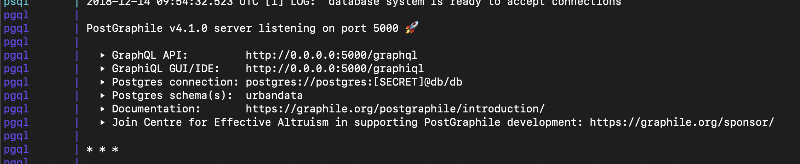
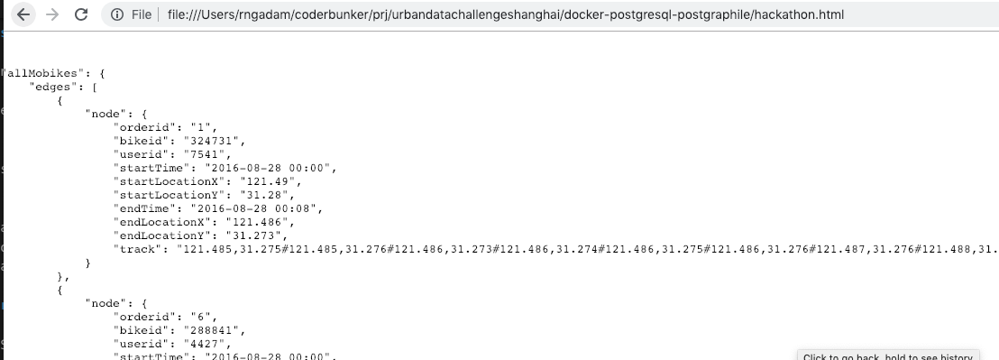

# Hackathon example

## Overview

Cover the full flow as easily as possible of building a data driven application:

* data import
* analysis
* machine learning model creation
* database
* web API
* web frontend

Install and setup should be minimal (beyond setting up Docker)


## Running

Use docker:

```
git clone git@github.com:urbandatachallengeshanghai/docker-postgresql-postgraphile.git
cd docker-postgresql-postgraphile
```

Follow the instructions in the README to setup Docker.



## Setting up the datasets

We've modified the docker image to mount ```./data``` on ```/data``` so you can put the datasets in the current directory to have access to it within docker.

```
mv  ~/Downloads/Urban\ Data\ Hackathon data/ data/
```

## Running the system

Running the containers:

```
docker-compose up
```

## Accessing the database

Recommend DBeaver https://dbeaver.io/download/ as the SQL interface

database is here:

```
postgres://postgres:1234@db/db
```

* username: postgres
* password: 1234
* database: db


## importing data

in the SQL client, run: ```sql/mobike-loader.sql```

This will load the mobike data into a table

## Data analysis with Jupyter

Access https://localhost

Connecting to the database:

```python
import psycopg2 as pg
import pandas.io.sql as pd
conn = pg.connect(host="db", database="db",user="postgres", password="1234")
df = pd.read_sql('SELECT * FROM urbandata.mobike LIMIT 10', conn)
df.head()
```


## Data analysis with RapidMiner

https://rapidminer.com/


## Developing API queries

Access: http://0.0.0.0:5000/graphiql


## Creating a frontend

edit/open/reload ```hackathon.html``` in the browser


